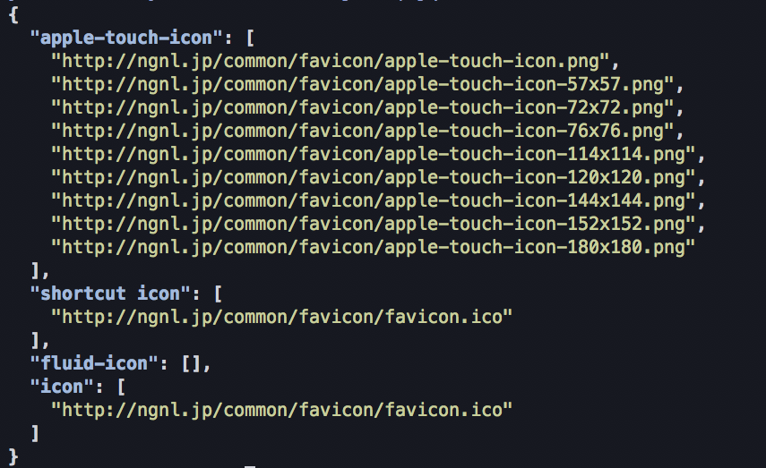

# web-icon-node
Webクリップアイコンやファビコンなどのリンクを取得するライブラリです。

## Usage
#### install
``` 
npm install web-icon-node 
```

#### demo.coffee
```demo.coffee
web_icon = require 'web-icon-node'

web_icon.get 'http://ngnl.jp', (list) ->
  console.log list
```

